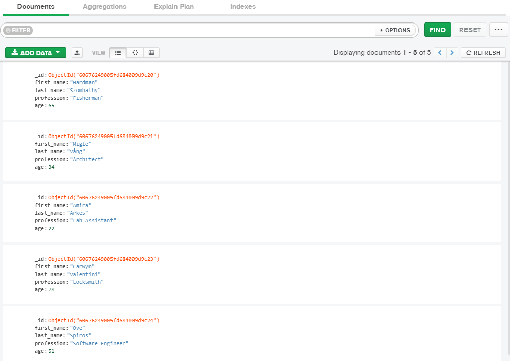

# Beginner’s guide to MongoDB and Rust
These days non-relational databases are everywhere. Almost all popular languages have drivers for these databases. Personally,
I’m a fan of MongoDB as it’s fairly easy to work with, performs well, and suits all my needs and *then some*!

In this post, we’ll take a look at the [Rust driver for MongoDB](https://docs.mongodb.com/drivers/rust/). By the end of this
article you’ll be able to operate on your own collections using Rust.

Please bear in mind that this article will stick to relatively basic operations. The goal of this article is to get you up to
speed with the MongoDB driver, that’s all.

We will learn how to:

* Connect to a MongoDB instance using a connection string.
* Insert data into a collection.
* Read data from a collection.
* Update an entry in a collection.
* Delete data from a collection.

## Asynchronous or not?
One of the very first decisions you have to make is whether you’d like to query the database synchronously or asynchronously.
The driver supports both synchronous and asynchronous operations, so it’s up to you to choose the one that suits your needs
best.

The driver supports both [Tokio](https://tokio.rs/) and [async-std](https://async.rs/) runtimes for asynchronous processing,
but Tokio is used by default. Since I don’t really care too much about which asynchronous runtime we’ll use, I’ll stick with
the default: Tokio.

Be sure to check out the [documentation](https://github.com/mongodb/mongo-rust-driver#example-usage) if you’d like to change
the default behavior of the driver. It also describes how to make use of the synchronous methods (should you want to use those
instead).

## Dependencies
Getting started with the MongoDB driver for Rust is easy, just add it as a dependency to your `Cargo.toml` file and you’re good
to go!

I’ve also added Tokio as a dependency, but that’s just because I use the asynchronous version of the MongoDB driver.

```toml
[package]
name = "mongodb_rust"
version = "0.1.0"
authors = ["Tahar Meijs <mail@example.com>"]
edition = "2018"

[dependencies]
mongodb = "1.2.0"
tokio = { version = "0.2", features = ["full"] }
```

## Connecting to MongoDB
We’ll use a connection string to connect to a MongoDB instance.

```rs
#[tokio::main]
async fn main() -> Result<(), Box<dyn std::error::Error>> {
    // Connect to the MongoDB instance
    let client = Client::with_uri_str("mongodb://localhost:27017").await?;
    Ok(())
}
```

Once a connection has been established, we can use the client instance to get access its databases and, in turn, their
collections and documents.

```rs
// Retrieve a database from the client
let database = client.database("mongodb_rust");

// Retrieve a collection from the database
let collection = database.collection("bson_macro_example");
```

## Inserting data into a collection
Let’s start out by investigating how we can create documents.

We’ll need to find a way to serialize data before we can store it in MongoDB. Data in MongoDB is stored in a JSON-like format.
Since JSON isn’t a compact, nor efficient format, MongoDB uses [BSON](https://en.wikipedia.org/wiki/BSON)(binary JSON) instead.

To help us generate BSON, the MongoDB driver comes with a special macro to generate BSON. Alternatively,
[serde.rs](https://crates.io/crates/serde) can be used to easily serialize structures into BSON as well.

We’ll cover both approaches below.

### BSON using “doc!”
In the BSON module, we find the `doc!` macro. This macro can be used to quickly create BSON data.

To make use of this macro, add the following
“[use declaration](https://doc.rust-lang.org/reference/items/use-declarations.html)” to the top of your Rust source file:
`use mongodb::bson::doc`.

We can then use the macro to generate a new BSON document:

```rs
// Construct a simple document with two properties: a string and an integer
let document = doc! {
    "question": "What is the answer to life, the universe, and everything?",
    "answer": 42
};
```

### BSON from a structure
Generating BSON from a structure is slightly more complex. It’s not terribly difficult, but we will need to update our
`Cargo.toml` file to include the Serde crate:

```toml
[package]
name = "mongodb_rust"
version = "0.1.0"
authors = ["Tahar Meijs <mail@example.com>"]
edition = "2018"

[dependencies]
mongodb = "1.2.0"
tokio = { version = "0.2", features = ["full"] }
serde = "1.0.125"
```

We need Serde so we can get make use of its Serialize and Deserialize attributes: `use serde::{Serialize, Deserialize};`

Now that we have Serde as a dependency, we can create a new data structure that will represent our document. The big advantage
of representing structures instead of the macro mentioned previously is that you can now easily modify the document’s
structure.

The new structure will have the same fields as the BSON generated by the macro. This allows for easy comparison between the two
approaches.

```rs
#[derive(Debug, Serialize, Deserialize)]
struct MyData {
    question: String,
    answer: i32
}
```

This structure has three annotations:

* **Debug**: allow for easy printing of its contents to the console.
* **Serialize**: attribute provided by Serde to serialize data
* **Deserialize**: attribute provided by Serde to deserialize data

Creating an instance of this structure is straightforward and will not be covered. It works exactly the same as any other
structure in Rust.

### Inserting data
We took a bit of a detour there with all the BSON talk… But we’re finally ready to start inserting data into our collections!

Inserting BSON data generated with the macro is easy enough:

```rs
let my_document = doc! { "my_key": "value", "my_number", 32 };
collection.insert_one(my_document, None).await?;
```

If you’re using structures, however, you’ll run into an error that tells you that a structure of type `mongodb::bson::Document`
is expected.

To fix this, import the `mongodb::bson::to_document` function. This method allows us to serialize our structure into BSON as
shown in the snippet below:

```rs
// Convert the structure into a BSON document and insert it into the collection
let bson_document = to_document(&my_struct)?;
collection.insert_one(bson_document, None).await?;
```

## Reading data from a collection
One of the common operations you’ll most likely perform on your collections is reading data from them. The BSON currently in
our database is fairly boring, so we’ll clear out the existing collection to prepare for the next chapter…

Also, let’s create a new structure called `Person` and give it some properties:

```rs
#[derive(Debug, Serialize, Deserialize)]
struct Person {
    first_name: String,
    last_name: String,
    profession: String,
    age: i32
}
```

We’ll go ahead and insert a couple of these objects into the collection. Check out the previous chapter to learn how you can
insert the data.

Bonus points: read the documentation and use `insert_many` to insert a bunch of documents at once!

If all went well, you should end up with a database that looks somewhat like so:



Reading data from a collection is relatively easy. You have multiple functions at your disposal to do so. I’d highly recommend
looking at the documentation to see what the other functions do, but we’re just going to have a look at the `find_one()`
function.

This function does exactly what you’d expect it to do: it’ll find a single entry in the database that matches your filter.

```rs
// A filter is simply a BSON document
// In this case the filter looks for a document with a "first_name" key and a value of "Hardman"
let filter = doc! { "first_name": "Hardman".to_owned() };

// Attempt to find a document that matches the filter
let result = collection.find_one(filter, None).await?;

// Use the result
match result {
    Some(ref document) => {
        let first_name = document.get_str("first_name")?;
        let last_name = document.get_str("last_name")?;
        let profession = document.get_str("profession")?;
        let age = document.get_i32("age")?;

        println!("Found {} {}, who is a {}, and is {} years old", first_name, last_name, profession, age);
    },
    None => println!("Unable to find a match in the collection")
}
```

As you may have noticed, we use a BSON document as a filter. You could, of course, use a structure here instead. Just serialize
it into a BSON document and you’re good to go.

Personally, I find the macro easier to read and use, but that’s just personal preference.

## Updating data in a collection
Updating data in collections is relatively simple. The difficult part is constructing a good query. Once you have a query,
you’ll just have to make a call to `update_one` or `replace_one` in order to submit your updated data.

```rs
// Simple BSON filter based on the first name of a person
let filter = doc! { "first_name": "hardman".to_owned() };

// Change the age (see MongoDB documentation on the usage of "$set")
let update = doc! { "$set": { "age": 91 } };

// Attempt to find a document that matches the filter and update it's field
let result = collection.update_one(filter, update, None).await?;
println!("Modified {} document(s)", result.modified_count);
```

You’ll have to make the decision whether it’s better to update a couple of fields, or replace the entire document with a new
one. Both functions take in almost identical arguments, so it should be easy to convert the code above into a replace operation
instead.

## Deleting data from a collection
Removing your data is as easy reading it. In fact, the code is pretty much identical, except for the function’s name!

```rs
// Simple BSON filter based on the first name of a person
let filter = doc! { "first_name": "Hardman".to_owned() };

// Attempt to find a document that matches the filter and remove it from the collection
let result = collection.delete_one(filter, None).await?;
println!("Removed {} document(s)", result.deleted_count);
```

## Closing words
I hope this short introduction to the MongoDB Rust driver has helped you to get up to speed with MongoDB and Rust. Obviously
there’s a ton of stuff we haven’t covered yet in this article, but you should now have enough knowledge to figure it out by
yourself.

For instance, we’ve only covered the simplest database functions. The driver comes with a bunch of other functions such as
`find`, `find_one_and_update`, `find_one_and_delete`, `insert_many`, `count_documents`, and many others!

I’d highly recommend you to check out the crate’s [documentation](https://docs.rs/mongodb/1.2.0/mongodb/index.html) to learn
more about the Rust driver.

Thank you so much for taking the time to read this article.

Have a good one.

Cheers!
